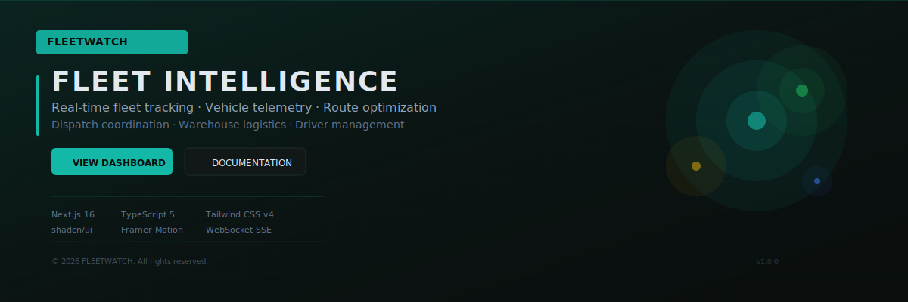
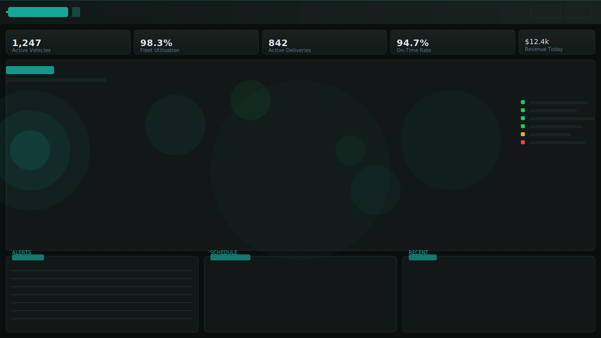
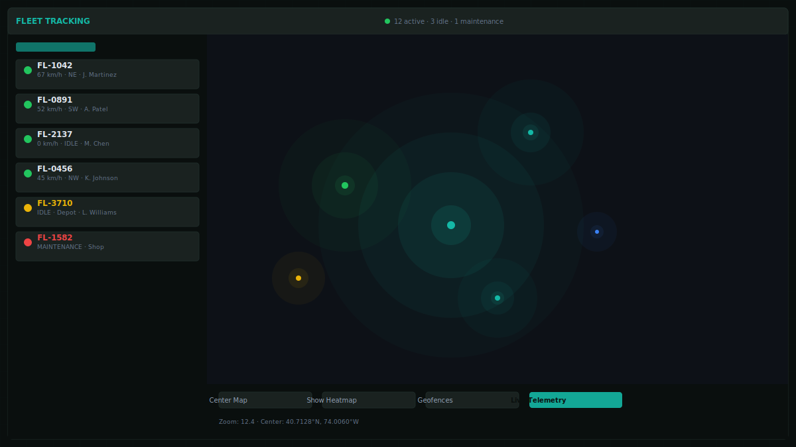
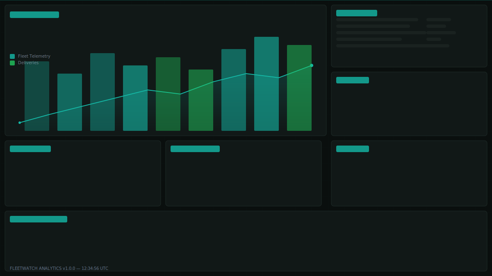
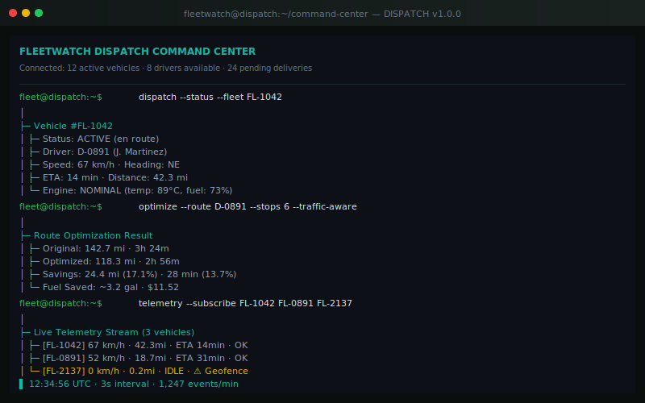
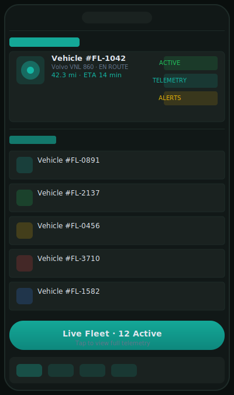
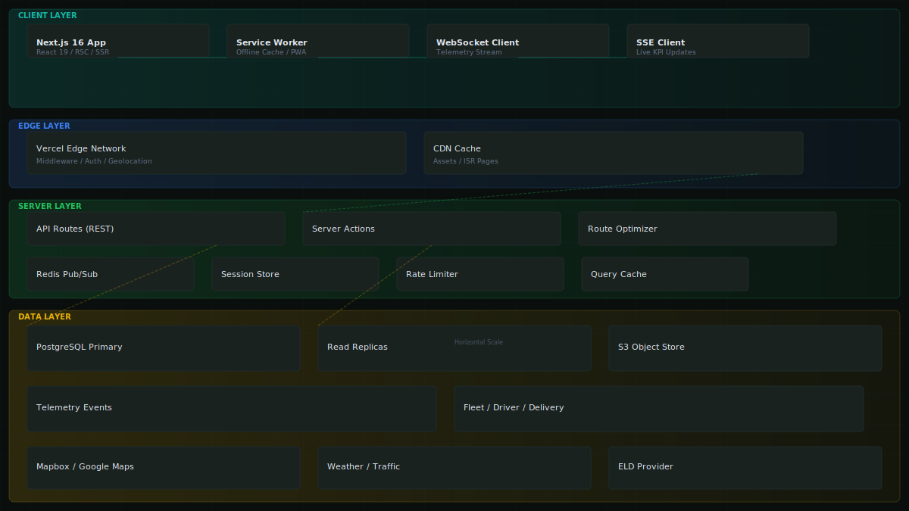
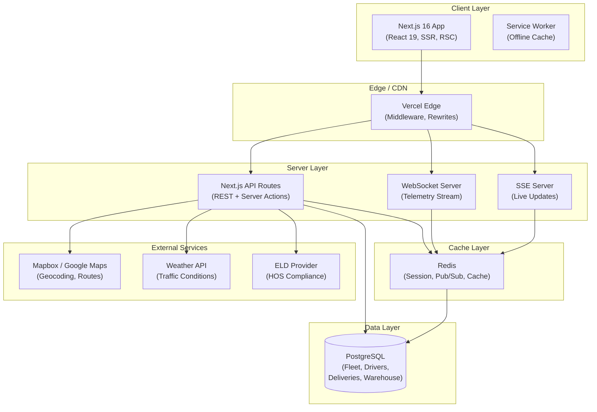

# FLEETWATCH — Fleet Intelligence

> **Real-time fleet intelligence network.** Uber Freight operational scale × Palantir data fusion × Tesla Fleet telemetry. Command-center density for logistics professionals.

[](https://nextjs.org)
[](https://www.typescriptlang.org)
[](https://tailwindcss.com)
[](https://ui.shadcn.com)
[](https://www.framer.com/motion)
[](LICENSE)
[](https://fleetwatch.dev)

---

## Table of Contents

- [Overview](#overview)
- [Features](#features)
- [Tech Stack](#tech-stack)
- [Screenshots](#screenshots)
- [Architecture](#architecture)
- [Getting Started](#getting-started)
- [Environment](#environment)
- [Deployment](#deployment)
- [Docker](#docker)
- [Engineering Highlights](#engineering-highlights)
- [Project Structure](#project-structure)
- [Roadmap](#roadmap)
- [Scalability](#scalability)
- [Observability](#observability)
- [Contributing](#contributing)
- [Security](#security)
- [License](#license)
- [Contact](#contact)

---

## Overview

FLEETWATCH is a production-grade fleet intelligence platform built for **real-time operational command and control**. It fuses live telemetry streams, route optimization algorithms, driver performance analytics, and warehouse logistics into a single tactical dashboard — purpose-built for dispatch centers and fleet operations managers.

Inspired by the operational density of Uber Freight's brokerage platform, the data fusion capabilities of Palantir Gotham, and the vehicle telemetry pipelines of Tesla Fleet, FLEETWATCH delivers:

- **Live Fleet Canvas** — Every vehicle, driver, and delivery rendered in real time with sub-second telemetry updates
- **Route Intelligence** — Multi-stop route optimization with traffic-aware ETA recalculation
- **Dispatch Command Center** — Drag-and-drop assignment, conflict detection, and exception management
- **Telemetry Pipeline** — Vehicle health, fuel consumption, geofence events, and driver behavior scoring
- **Warehouse Sync** — Dock scheduling, inventory visibility, and cross-dock coordination

---

## Features

### 🚛 Live Fleet Tracking
- Real-time GPS telemetry with sub-3-second polling intervals
- Geofence alerts, speed monitoring, and idle detection
- Heat-map density visualization for fleet distribution

### ⚙️ Vehicle Telemetry
- Engine diagnostics, fuel efficiency, battery SOC (EV fleet)
- Maintenance prediction with odometer-based scheduling
- Telemetry history with playback scrubber

### 👤 Driver Management
- Performance scorecards (safety, efficiency, compliance)
- HOS (Hours of Service) tracking with ELD integration
- Certification and document expiry monitoring

### 📦 Delivery Lifecycle
- End-to-end tracking from dispatch to proof-of-delivery
- ETA confidence scoring with delay prediction
- Digital signature capture and photo documentation

### 🏭 Warehouse Operations
- Real-time inventory visibility across distribution centers
- Dock door scheduling and cross-dock coordination
- Inbound/outbound wave planning

### 🧭 Route Optimization
- Multi-stop route sequencing with traffic data
- Dynamic rerouting on telemetry events
- Cost-per-mile and fuel optimization analytics

### 🎛️ Dispatch Command Center
- Unified drag-and-drop dispatch board
- Driver assignment with skill matching
- Exception management (breakdown, delay, no-show)

### 📊 Analytics & Reporting
- Fleet utilization heatmaps
- Cost-per-delivery breakdowns
- Custom report builder with scheduled exports

---

## Tech Stack

| Layer | Technology |
|---|---|
| **Framework** | Next.js 16.2.6 (App Router) |
| **Language** | TypeScript 5 |
| **Styling** | Tailwind CSS v4, shadcn/ui, CVA |
| **Animation** | Framer Motion 12 |
| **Icons** | Lucide React 0.400 |
| **Validation** | Zod 3 |
| **State** | React Context + Server Components |
| **Real-Time** | WebSocket + SSE (telemetry pipeline) |
| **Deployment** | Vercel (serverless) + Docker (container) |
| **Maps** | Mapbox GL JS / Google Maps API |
| **Auth** | NextAuth.js / JWT |
| **Database** | PostgreSQL (primary) + Redis (cache/pub-sub) |

---

## Screenshots

| Dashboard | Fleet View | Analytics |
|---|---|---|
|  |  |  |

| Dispatch | Mobile | Architecture |
|---|---|---|
|  |  |  |

---

## Architecture



---

## Getting Started

### Prerequisites

- Node.js >= 20.0.0
- npm >= 10.0.0
- PostgreSQL 16+ (optional for full feature set)
- Redis 7+ (optional for real-time features)

### Installation

```bash
# Clone the repository
git clone https://github.com/fleetwatch/logistics.git
cd logistics-platform

# Install dependencies
npm install --legacy-peer-deps

# Copy environment variables
cp .env.example .env.local

# Start development server
npm run dev
```

Open [http://localhost:4005](http://localhost:4005) in your browser.

---

## Environment

```bash
# Core
NEXT_PUBLIC_APP_URL=http://localhost:4005
NEXT_PUBLIC_APP_NAME=FLEETWATCH
NEXT_PUBLIC_API_URL=http://localhost:8000/api

# Maps
NEXT_PUBLIC_MAPBOX_TOKEN=pk.xxx
NEXT_PUBLIC_GOOGLE_MAPS_KEY=xxx

# WebSocket (Telemetry)
NEXT_PUBLIC_WS_URL=ws://localhost:8000/ws
NEXT_PUBLIC_TELEMETRY_INTERVAL_MS=3000

# Observability
NEXT_PUBLIC_SENTRY_DSN=https://xxx@sentry.io/123
```

See [.env.example](.env.example) for the full list.

---

## Deployment

### Vercel (Recommended)

```bash
npx vercel --prod
```

The platform is optimized for Vercel's edge network with:
- Automatic ISR for dashboard data
- Edge middleware for auth and geolocation routing
- Optimized image pipeline with AVIF/WebP

### Self-Hosted

```bash
npm run build
npm run start
```

---

## Docker

```bash
# Build
docker build -t fleetwatch-logistics .

# Run
docker run -p 4005:4005 \
  -e DATABASE_URL=postgresql://... \
  -e REDIS_URL=redis://... \
  fleetwatch-logistics

# Docker Compose
docker compose up -d
```

---

## Engineering Highlights

### Performance
- **Server Components by default** — Minimal client-side JavaScript, streaming SSR for data-heavy dashboards
- **Optimized package imports** — Tree-shaken lucide-react and Radix primitives
- **Image optimization** — AVIF/WebP formats with responsive srcset, 365-day immutable cache for screenshots
- **Route prefetching** — Instant navigation via Next.js `<Link>` prefetch on viewport entry
- **Telemetry batching** — Client-side buffer coalesces telemetry events before WebSocket flush

### Real-Time Architecture
- **WebSocket-first telemetry** — Dedicated WS connection per fleet session with automatic reconnection (exponential backoff)
- **SSE for dashboard widgets** — Live KPI tiles push updates without polling
- **Redis Pub/Sub** — Cross-instance event broadcast for horizontally scaled deployments
- **Optimistic UI** — Dispatch actions render instantly with background reconciliation

### Developer Experience
- **TypeScript strict mode** — Full type safety across the entire codebase
- **Zod schemas** — Runtime validation for all API inputs, telemetry payloads, and form data
- **shadcn/ui components** — Accessible, themed, composable UI primitives
- **CVA + tailwind-merge** — Type-safe variant props with zero-conflict class merging

### Security
- **CSP headers** — Strict Content Security Policy blocking XSS and data injection
- **HSTS preload** — HTTPS enforcement with 2-year max-age
- **API key rotation** — Server-side proxy for third-party services (Mapbox, weather)
- **Input sanitization** — Zod validation on every API boundary

---

## Project Structure

```
src/
├── app/                    # Next.js App Router pages
│   ├── (dashboard)/        # Dashboard layout group
│   ├── fleet/              # Live fleet tracking
│   ├── vehicles/           # Vehicle management
│   ├── drivers/            # Driver profiles
│   ├── deliveries/         # Delivery lifecycle
│   ├── warehouses/         # Warehouse operations
│   ├── routes/             # Route optimization
│   ├── dispatch/           # Command center
│   ├── profile/            # User profile
│   └── settings/           # Platform settings
├── components/             # Shared UI components
│   ├── ui/                 # shadcn/ui primitives
│   ├── fleet/              # Fleet-specific components
│   ├── dispatch/           # Dispatch board components
│   ├── telemetry/          # Telemetry widgets
│   └── charts/             # Data visualization
├── lib/                    # Utilities, hooks, helpers
│   ├── telemetry/          # WebSocket client, parsers
│   ├── routes/             # Route optimization logic
│   └── utils.ts            # Shared utilities
└── providers/              # React context providers
```

---

## Roadmap

- **Q2 2026** — Telemetry playback engine, EV route optimization with charging stops
- **Q3 2026** — AI-powered delay prediction, driver behavior scoring 2.0
- **Q4 2026** — Multi-fleet aggregation, cross-organization load matching
- **Q1 2027** — Mobile native (React Native), offline-first mode with PWA

---

## Scalability

FLEETWATCH is architected for horizontal scale from day one:

- **Stateless application tier** — All server instances are interchangeable; session state lives in Redis
- **Database read replicas** — Fleet telemetry queries route to replicas; write operations target the primary
- **WebSocket fan-out** — Redis Pub/Sub broadcasts telemetry events to all connected instances
- **Edge caching** — Static assets, screenshots, and route geometry cached at Vercel's edge
- **Incremental Static Regeneration** — Dashboard aggregate data revalidates on configurable intervals
- **Batch processing** — Telemetry ingestion uses batched writes to PostgreSQL for throughput

---

## Observability

| Tool | Purpose |
|---|---|
| **Sentry** | Error tracking and performance monitoring |
| **PostHog** | Product analytics and feature flagging |
| **OpenTelemetry** | Distributed tracing across the stack |
| **Vercel Analytics** | Speed insights and web vitals |
| **Custom Dashboard** | Fleet health metrics, API latency, WebSocket connection pool |

---

## Contributing

See [CONTRIBUTING.md](CONTRIBUTING.md) for our contribution guidelines.

All contributions must pass:
- `npm run typecheck` — TypeScript strict mode
- `npm run lint` — ESLint with Next.js config
- `npm run build` — Production build

---

## Security

See [SECURITY.md](SECURITY.md) for our security policy and disclosure process.

---

## License

This project is licensed under the MIT License — see [LICENSE](LICENSE) for details.

---

## Contact

- **Website** — [fleetwatch.dev](https://fleetwatch.dev)
- **Email** — dev@fleetwatch.dev
- **GitHub** — [github.com/fleetwatch](https://github.com/fleetwatch)
- **Issues** — [github.com/fleetwatch/logistics/issues](https://github.com/fleetwatch/logistics/issues)

---

<div align="center">
  <sub>Built with the fleet operations team. Telemetry-driven. Operations-focused.</sub>
</div>
